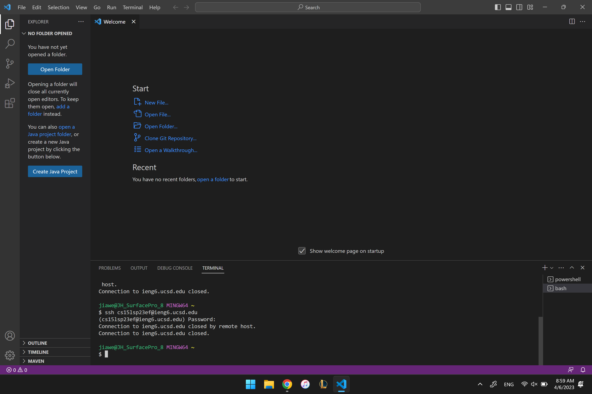
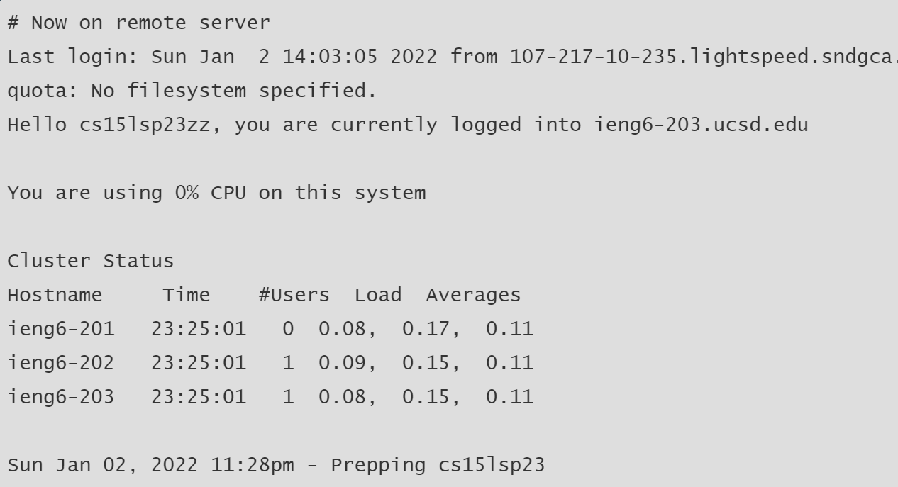
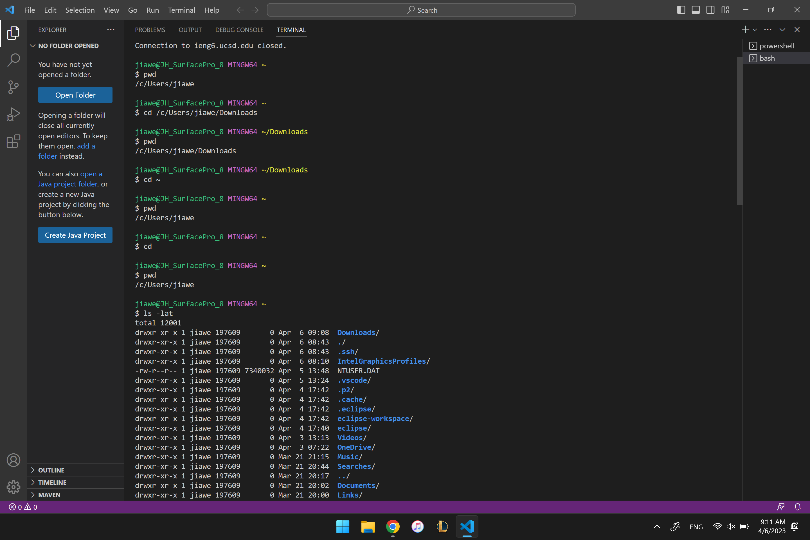

**Install VScode**
1. Step 1: Google VScode Download
2. Step 2: Click on the link that said Downlad Visual Studio Code - Mac, Linus, Windows
3. Step 3: Depending on which operating system you are on, click download on one you are on. For example, click the download button under the window icon if your operating system is window.
4. Step 4: Run the Installer after it finished downloading.
5. Step 5: You have finished downloading VScode! 
6. (refer to the image below to check what VScode looks like after it get launched the first time.)

**Remotely Connecting**
1. Step 1: Download Git from (https://gitforwindows.org/)
2. Step 2: Run the Installer after it finish downloading.
3. Step 3: Go to VScode and open the terminal.
4. Step 4: Open the command palette using Ctrl + Shift + P
5. Step 5: Type "Selecte Default Profile"
6. Step 6: Select Git Bash from the options
7. Step 7: Click on the + icon in the terminal window
8. Step 8: The new terminal now will be a Git Bash terminal.
9. Step 9: Look up your CSE 15L account from https://sdacs.ucsd.edu/~icc/index.php
10. Step 10: Find your account by typing your Last Name and Student ID and then click Submit
11. Step 11: Click on the Account Name that start with cs15l and reset the password
12. Step 12: Go back to VS code and type "ssh cs15lsp23zz@ieng6.ucsd.edu" in the Git Bash terminal
13. Step 13: The terminal will print out a message and ask "Are you sure you want to continue coneecting(yes/no)
14. Step 14: Type yes
15. Step 15: The terminal will prompt you to enter the password, enter the password that you just made
16. Step 16: Note that password will not be visible when you type it
17. Step 17: Once you have enter the password, the terminal will display the status of the server. (Refer to the image below to check what the terminal will display after the password is entered.)

**Trying Some Commands**
Step 1: Open VS code and make sure the terminal is a Git Bash terminal
Step 2: Try the following commands
cd ~
cd ls -lat
ls -a
pwd
(Refer to the image below to check what would the output would be after some of the code above are type.)

