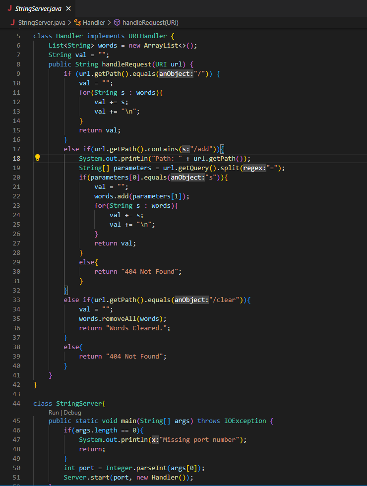
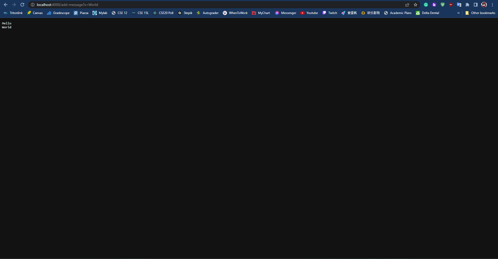
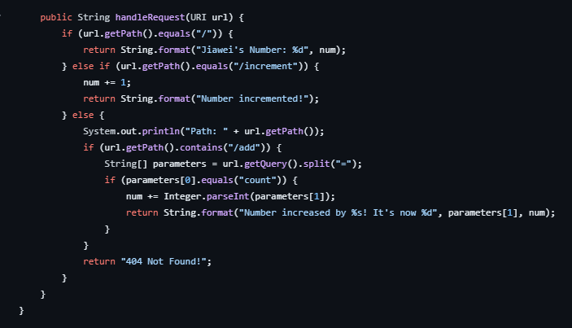

# **Part 1**
1. My String Server Code:

ScreenShots After using Add-Message 

1. The Method "Handle Request" is being Called
2. The relevant argument to this method is the string(the string is "Hello" in this case) follow by add-message
3. The value changes as I type multiple string using add-message
4. The string will then save in the arraylist varaible called "words" and then input it into the String varaible called "Val"

1. The Method "Handle Request" is being Called
2. The relevant argument to this method is the string(the string is "World" in this case) follow by add-message
3. The value changes as I type multiple string using add-message
4. The string will then save in the arraylist varaible called "words" and then input it into the String varaible called "Val"

# **Part 2**

1. This is the code I borrow from the previous lab and the issue is obvious that this will not work for this lab. 
2. Therefore, To fix this, I change the code according to the need of this lab by for example, remove command increment and count and add in arraylist variable so that I can save multiple String inside.

# **Part 3**
1. Throughout the lab in week 2 and week 3, it taught me how to write code in java that can start a webpage server. 
2. Additionally, I can also write method that I can use to do some interesting action within the webpage server such as printing out message that is written within the URL
