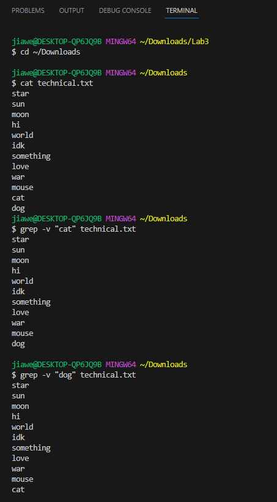
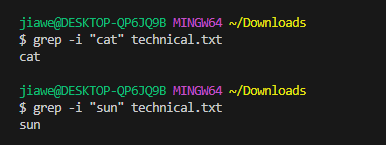
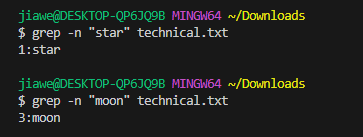
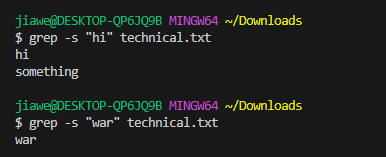

# **Lab Report 3**

Source: [Link](https://www.oreilly.com/library/view/java-cookbook/0596001703/ch04s14.html)

The Command I choose: 'grep'

1. First Command Option: -v

1. Second Command Option: -i

1. Third Command Option: -n

1. Fourth Command Option: -s

